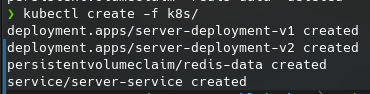

# ece-devops-2022-blair-bon

## Introduction

Projet du premier semestre de quatrième année à l'ECE en DevOps.

Le contenu créé pour les LABs est disponible dans le dossier [labs](/labs/).

Rendu le 23/12/2021.

## Cahier des charges

Le cahier des charges du projet est disponible dans son intégralité [ici](https://github.com/adaltas/ece-devops-2022-fall/blob/main/project/instructions.md). En résumé, il nous est demandé d'intégrer toutes les notions vues en cours dans un projet. Nous devons donc :

1. Créer une **application web** basique.
1. Appliquer le **CI**/**CD**.
1. Configurer et provisionner un environnement virtuel et lancer l'application avec l'approche **IaC**.
1. Build une image **Docker** de l'application.
1. Faire de l'orchestration avec **Docker Compose**.
1. Faire de l'orchestration avec **Kubernetes**.
1. Faire du maillage de services avec **Istio**.
1. Implémenter un système de monitoring avec **Prometheus** et **Grafana**.
1. Ajouter des **bonus**.

## Installation

Il est nécessaire d'avoir **NodeJS** et **npm** installés sur la machine pour pouvoir lancer l'application.

Il suffit de cloner le dépôt pour pouvoir lancer l'application.

```bash
git clone https://github.com/Aurelien-Bon/ece-devops-2022-blair-bon.git
```

## Utilisation

### 1. Créer une application web basique

Se rendre dans le dossier userapi et lancer la commande suivante :

```bash
npm install
```

Pour lancer l'application, il faut lancer la commande suivante :

```bash
npm run start
```

Une fois l'application lancée, elle est accessible à l'adresse suivante : [http://localhost:3000](http://localhost:3000).

- L'accès à la route `/` renvoie un message de bienvenue *Hello World*.
- Accéder à la route `/users/test` permet de vérifier si la communication avec redis - fonctionne.
- Pour ajouter un utilisateur à la base de données, il faut rentrer l'adresse suivante dans **Postman** ou tout autre logiciel similaire en méthode **POST** : <<http://localhost:3000/>- user/?username=%7Busername%7D&firstname=%7Bfirstname%7D&lastname=%7Blastname%7D>.
- Pour récupérer les informations d'un utilisateur, il faut rentrer à l'adresse suivante dans - **Postman** en méthode **GET** : <http://localhost:3000/user/%7Busername%7D>.
- Pour supprimer un utilisateur, il faut se rentrer l'adresse suivante en méthode **DELETE** : <http://localhost:3000/user/%7Busername%7D>.
- Pour mettre à jour un utilisateur, il faut rentrer l'adresse suivante en méthode **PUT** : <http://localhost:3000/user/?username=%7Busername%7D&firstname=%7Bfirstname%7D>&- lastname=%7Blastname%7D>.

Pour lancer les tests, il faut lancer la commande suivante :

```bash
npm run test
```

Les tests sont réalisés avec **Mocha** et **Chai** et lancent automatiquement des requêtes **GET**, **POST**, **PUT** et **DELETE** sur l'application.

Le résultat des tests :


### 2. Appliquer le **CI**/**CD**

Un fichier **YAML** est disponible dans le dossier [.github](/.github) pour lancer les tests à chaque push sur la branche **main**. Cela testes l'application et vérifie que les tests passent, puis déploye l'application sur **Azure**. L'application est ensuite accessible à l'adresse suivante : <https://blair-bon-devops.azurewebsites.net/>

Nous n'avons cependant pas réussi à configurer la base de donnée pour la version déployée sur **Azure**.

### 3. Configurer et provisionner un environnement virtuel et lancer l'application avec l'approche **IaC**

Pour lancer la machine virtuelle Vagrant,

### 4. Build une image Docker de l'application

Un DockerFile est créé dans le dossier [userapi](/userapi) pour créer une image Docker de l'application. Pour créer l'image, il faut se rendre dans le dossier [userapi](/userapi) et lancer la commande suivante :

```bash
docker build -t server .
```

Pour lancer l'image, il faut lancer la commande suivante, en ayant **redis** de lancé en arrière plan :

```bash
docker run -p 3000:3000 server
```

L'application est alors accessible à l'adresse suivante : <http://localhost:3000/>.

Une version de l'image est disponible sur **Docker Hub** à l'adresse suivante : <https://hub.docker.com/repository/docker/ahddry/server-devops-blair-bon-2022>

Pour lancer l'image, il faut lancer la commande suivante, en ayant **redis** de lancé en arrière plan :

```bash
docker run -p 3000:3000 ahddry/server-devops-blair-bon-2022
```

L'application est alors accessible à l'adresse suivante : <http://localhost:3000/>.

### 5. Faire de l'orchestration avec **Docker Compose**

Un fichier **YAML** [docker-compose.yml](/docker-compose.yml) est créé à la racine du projet pour lancer l'application avec **Docker Compose**. Pour lancer l'application, il faut lancer la commande suivante :

```bash
docker-compose up
```

L'application est alors accessible à l'adresse suivante : <http://localhost:3000/>.

> **Note :** Pour lancer l'application avec **Docker Compose**, il faut veiller à ce qu'une autre instance de **redis** ne soit pas lancée en arrière plan, pour l'arrêter, il faut lancer la commande suivante : `sudo systemctl stop redis`.


Si tout se passe bien, vous devriez obtenir le résultat suivant à l'adresse <http://localhost:3000/user/test> :


### 6. Faire de l'orchestration avec **Kubernetes**

Il faut tout d'abord s'assurer que **Kubernetes** est bien lancé sur la machine. Pour cela, il faut lancer la commande suivante :

```bash
minikube start
```

Pour lancer l'application avec **Kubernetes**, il faut lancer la commande suivante (en étant à la racine du projet) :

```bash
kubectl create -f k8s/
```

Le terminal affiche ceci :



Deux pods sont alors lancés, un pour une première version de l'application et un pour une seconde version de l'application. Pour vérifier que les pods sont bien lancés, il faut lancer la commande suivante, les deux pods doivent être en état **Running** :

```bash
kubectl get pods
```

Un persistent volume claim est également créé pour stocker les données de la base de données. Pour vérifier que le persistent volume claim est bien créé, il faut lancer la commande suivante :

```bash
kubectl get persistentvolumeclaims
```

Pour lancer dans le navigateur l'application, il faut lancer la commande suivante :

```bash
minikube service server-service
```

Le terminal affiche ceci :


### 7. Faire du maillage de services avec **Istio**

Pour lancer **Istio**, il faut tout d'abord avoir **istioctl** d'installé sur la machine, téléchargeable à l'adresse suivante : <https://istio.io/latest/docs/setup/getting-started/#download>. Il faut ensuite vérifier que le namespace **default** est peut injecter istio dans ses containers, pour cela, il faut lancer la commande suivante :

```bash
kubectl label namespace default istio-injection=enabled
```

> **Note :** Si ce n'était pas le cas, il faudra alors relancer tous les pods de **Kubernetes** pour qu'ils soient injectés par **Istio**.

Pour rendre **Istio** actif, il faut lancer la commande suivante :

```bash
kubectl create -f istio/
```

Le terminal affiche ceci :


Il faut ensuite lancer la série de commandes suivantes :

```bash
minikube tunnel
```

Pour récupérer l'adresse IP de **Istio**, il faut lancer les commandes suivantes dans une autre fenêtre de terminal :

```bash
export INGRESS_HOST=$(kubectl -n istio-system get service istio-ingressgateway -o jsonpath='{.status.loadBalancer.ingress[0].ip}')
export INGRESS_PORT=$(kubectl -n istio-system get service istio-ingressgateway -o jsonpath='{.spec.ports[?(@.name=="http2")].port}')
export SECURE_INGRESS_PORT=$(kubectl -n istio-system get service istio-ingressgateway -o jsonpath='{.spec.ports[?(@.name=="https")].port}')
export GATEWAY_URL=$INGRESS_HOST:$INGRESS_PORT
echo "Seulement la version v1 de l'application: http://$GATEWAY_URL/v1/"
echo "Seulement la version v2 de l'application: http://$GATEWAY_URL/v2/"
echo "Traffic shifting entre les version de l'application: http://$GATEWAY_URL/"
```

Le terminal affiche ceci :


Cliquer sur l'un des liens affichés dans le terminal permet d'accéder à la version correspondante de l'application. Pour accéder au dashboard de **Istio** et ainsi voir les différentes requêtes envoyées à l'application, il faut lancer la commande suivante :

```bash
istioctl dashboard kiali
```


On peut donc constater que les fonctionnalités de *route requests* et *traffic shifting* fonctionnent bien.

### 8. Implémenter un système de monitoring avec **Prometheus** et **Grafana**

Pour lancer **Prometheus** et **Grafana**, il faut lancer la commande suivante :

```bash
kubectl apply -f https://raw.githubusercontent.com/istio/istio/release-1.16/samples/addons/prometheus.yaml

istioctl dashboard prometheus
```

Le dashboard de **Prometheus** s'ouvre alors dans le navigateur, voilà un exemple avec les données `kubelet_http_requests_total` :


Pour lancer **Grafana**, il faut lancer la commande suivante :

```bash
kubectl apply -f https://raw.githubusercontent.com/istio/istio/release-1.16/samples/addons/grafana.yaml

istioctl dashboard grafana
```

Le dashboard de **Grafana** s'ouvre alors dans le navigateur, voilà un exemple avec les données Istio Mesh :


### 9. **Bonus** réalisés

- API **CRUD** étendue

## Contributeurs

- Adrien Blair [@Ahddry](https://github.com/Ahddry)
- Aurélien Bon [@Aurelien-Bon](https://github.com/Aurelien-Bon)
